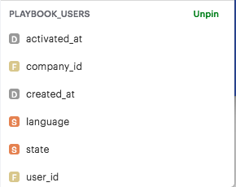
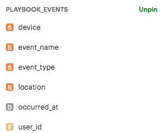

# funnel
SQL queries to create a conversion funnel on demo test data provided by [Mode Analytics](https://community.modeanalytics.com/sql/tutorial/introduction-to-sql/)

I learned the basics of SQL and wrote queries to determine user dropoff based on test-user data. 
I accessed two databases: 
1) playbook_users

2) playbook_events 

Using the data I determined how many users activated the accounts they created, and subsequently logged in once in March 2013.

This funnel gives insights on the onboarding process used on new customers, and can be executed upon. 133 users (dropoff from 225 activated accounts to 92 logins) are detected to be in churn risk, and action must be taken to get them back. The same funnel can be built a week from now to measure the delta conversion rate.
